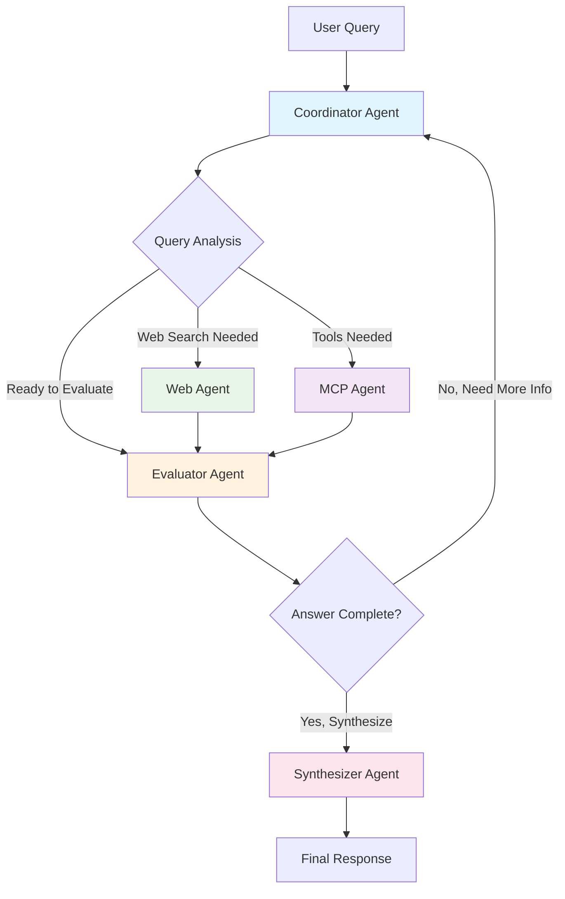

# 🚀 Enhanced LangGraph Multi-Agent Architecture

## Overview

The Enhanced Open-Alita system now implements a sophisticated multi-agent workflow using LangGraph to handle complex questions with intelligent coordination between specialized agents. This architecture provides scalable, intelligent reasoning with real-time streaming updates to the frontend.

## 🏗️ Architecture Components

### 1. **Coordinator Agent** (`LangGraphCoordinator`)

- **Purpose**: Intelligent query analysis and strategy planning
- **Responsibilities**:
  - Analyzes incoming queries to determine optimal processing strategy
  - Routes queries to appropriate agents based on requirements
  - Tracks workflow progress and iterations
  - Makes decisions on when to continue vs. synthesize final answer

### 2. **Web Agent** (`WebAgent`)

- **Purpose**: Advanced web search and content extraction
- **Capabilities**:
  - Firecrawl API integration for high-quality content scraping
  - DuckDuckGo fallback search
  - Intelligent query determination (can handle vs. needs MCP tools)
  - Real-time information gathering and synthesis

### 3. **MCP Agent** (`MCPFactory`)

- **Purpose**: Dynamic tool creation and execution
- **Features**:
  - On-demand creation of specialized tools
  - Secure sandboxed execution environment
  - Tool caching and reuse
  - Support for computational tasks, data processing, and custom functionality

### 4. **Evaluator Agent**

- **Purpose**: Answer completeness and quality assessment
- **Functions**:
  - Evaluates available information sufficiency
  - Calculates completeness scores (0.0-1.0)
  - Determines if more information is needed
  - Provides recommendations for next actions

### 5. **Synthesizer Agent**

- **Purpose**: Final comprehensive answer generation
- **Capabilities**:
  - Combines information from all sources
  - Creates well-structured, comprehensive responses
  - Cites sources appropriately
  - Acknowledges limitations when present

### 6. **Streaming Coordinator** (`StreamingCoordinator`)

- **Purpose**: Real-time frontend updates and session management
- **Features**:
  - Event-driven streaming architecture
  - Session management and tracking
  - Progress monitoring
  - Error handling and recovery

## 🔄 Workflow Flow



## 📊 Streaming Architecture

### Event Types

```python
class StreamEventType(Enum):
    WORKFLOW_START = "workflow_start"
    AGENT_START = "agent_start"
    AGENT_COMPLETE = "agent_complete"
    TOOL_CREATED = "tool_created"
    TOOL_EXECUTED = "tool_executed"
    WEB_SEARCH_RESULTS = "web_search_results"
    EVALUATION_UPDATE = "evaluation_update"
    SYNTHESIS_PROGRESS = "synthesis_progress"
    WORKFLOW_COMPLETE = "workflow_complete"
    ERROR = "error"
```

### Real-time Updates

The system provides real-time updates to the frontend including:

- Agent status transitions
- Tool creation and execution progress
- Web search results
- Answer quality metrics
- Final synthesis progress
- Error handling and recovery

## 🎯 Query Processing Strategies

### Strategy 1: Web Search First

**Best for**: Current events, factual information, research topics

```
Query → Coordinator → Web Agent → Evaluator → Synthesizer
```

### Strategy 2: Tool Creation First

**Best for**: Calculations, data processing, custom functionality

```
Query → Coordinator → MCP Agent → Evaluator → Synthesizer
```

### Strategy 3: Multi-Agent Combination

**Best for**: Complex queries requiring multiple information sources

```
Query → Coordinator → Web Agent → MCP Agent → Evaluator → Synthesizer
```

### Strategy 4: Iterative Refinement

**Best for**: Queries requiring multiple rounds of information gathering

```
Query → Coordinator → Agent(s) → Evaluator → Coordinator → ... → Synthesizer
```

## 🚀 Key Features

### Intelligent Routing

- LLM-powered query analysis determines optimal processing strategy
- Fallback logic ensures robustness
- Context-aware decision making

### Scalable Architecture

- Modular agent design allows easy extension
- State management for complex workflows
- Memory-efficient processing

### Real-time Streaming

- Event-driven updates to frontend
- Session management and tracking
- Progress monitoring and error handling

### Quality Assurance

- Answer completeness evaluation
- Confidence scoring
- Source attribution and limitation acknowledgment

## 📝 Usage Examples

### Basic Usage

```python
from src.agent.alita_agent import AlitaAgent

agent = AlitaAgent()
for chunk in agent.process_command_streaming("What's the latest news about AI?"):
    print(chunk, end="", flush=True)
```

### Advanced Usage with Session Tracking

```python
from src.agent.streaming_coordinator import StreamingCoordinator

coordinator = StreamingCoordinator()
session_id = coordinator.create_session("complex query")

# Process with session tracking
for event in workflow_stream:
    formatted_output = coordinator.format_streaming_output(event)
    # Send to frontend
```

## 🔧 Configuration

### Environment Variables

```bash
# Required for web search functionality
FIRECRAWL_API_KEY=your_firecrawl_key

# Optional: LLM provider configuration
OPENAI_API_KEY=your_openai_key
ANTHROPIC_API_KEY=your_anthropic_key
```

### Workflow Parameters

```python
# Maximum iterations before forced synthesis
max_iterations: int = 5

# Completeness threshold for synthesis
synthesis_threshold: float = 0.7

# Web search result limit
web_search_limit: int = 5
```

## 🧪 Testing

### Run Comprehensive Tests

```bash
python test_enhanced_langgraph.py
```

### Test Specific Components

```bash
# Test streaming architecture
python -c "from test_enhanced_langgraph import test_streaming_architecture; test_streaming_architecture()"

# Performance benchmarks
python -c "from test_enhanced_langgraph import benchmark_performance; benchmark_performance()"
```

## 📈 Performance Characteristics

### Typical Response Times

- Simple queries (direct answers): 2-5 seconds
- Web search queries: 5-15 seconds
- Tool creation queries: 3-10 seconds
- Complex multi-agent queries: 10-30 seconds

### Scalability

- Concurrent session support
- Memory-efficient state management
- Configurable resource limits

### Error Handling

- Graceful degradation on component failures
- Automatic fallback strategies
- Comprehensive logging and monitoring

## 🔮 Future Enhancements

### Planned Features

1. **Multi-modal Support**: Image, audio, and document processing
2. **Advanced Memory**: Persistent learning across sessions
3. **Custom Agent Plugins**: User-defined specialized agents
4. **Performance Optimization**: Caching and parallel processing
5. **Analytics Dashboard**: Real-time workflow monitoring

### Integration Opportunities

- WebSocket support for real-time communication
- REST API for external system integration
- Plugin architecture for custom agents
- Database integration for persistent state

## 🤝 Contributing

The architecture is designed for extensibility. To add new agents:

1. Inherit from base agent interface
2. Implement required methods
3. Add to LangGraph workflow
4. Update streaming coordinator
5. Add comprehensive tests

## 📚 References

- [LangGraph Documentation](https://langchain-ai.github.io/langgraph/)
- [Original Alita Research Paper](https://arxiv.org/abs/2505.20286)
- [Model Context Protocol (MCP)](https://modelcontextprotocol.io/)
- [Firecrawl API](https://docs.firecrawl.dev/)

---

_This architecture represents a significant evolution in agent-based reasoning, providing the foundation for handling increasingly complex queries with intelligence, efficiency, and reliability._
